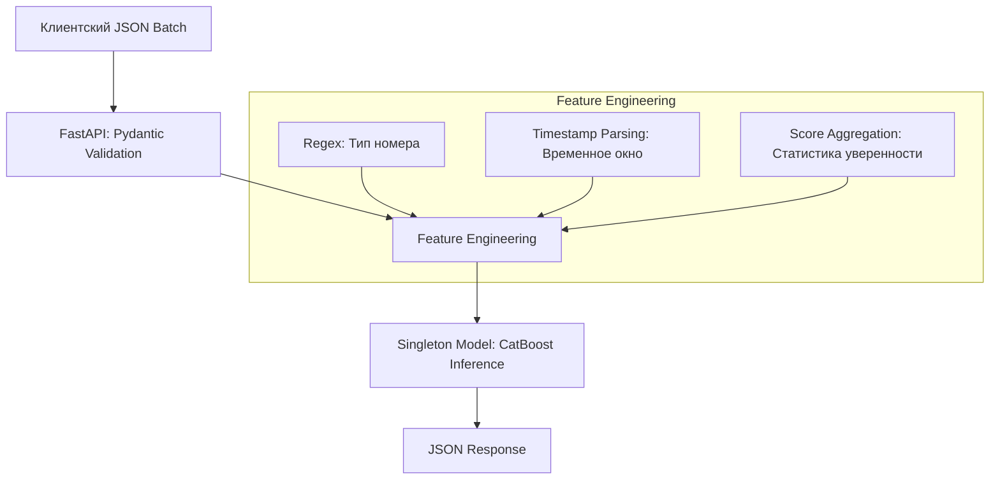

# ML Recognition Service (Regno Picker)

Промышленный микросервис для интеллектуального выбора и валидации государственных регистрационных знаков (ГРЗ), основанный на модели **CatBoost**.

Сервис спроектирован для работы в условиях высокой нагрузки и предназначен для интеграции ML‑моделей в продуктивную инфраструктуру через REST API.

---

## Назначение проекта

Сервис обрабатывает данные, поступающие с камер дорожного движения, и выполняет:

- классификацию распознанных регистрационных знаков;
- оценку вероятности корректности распознавания;
- агрегацию и нормализацию сигналов уверенности от upstream‑систем;
- формирование стандартизированного JSON‑ответа для downstream‑сервисов.

**Целевой показатель производительности:** до **500 запросов в секунду (RPS)** при корректной конфигурации окружения.

---

## Архитектура и логика работы

### Общая схема обработки



### Ключевые проектные решения

- **Singleton‑паттерн для модели**  
  Модель `micromodel.cbm` загружается один раз при инициализации сервиса. Это устраняет повторный I/O и снижает latency при инференсе.

- **Batch Processing**  
  API принимает массив объектов в одном запросе, минимизируя накладные расходы HTTP и повышая общую пропускную способность.

- **Конкурентность и масштабирование**  
  Используется ASGI‑стек (FastAPI + Uvicorn) с возможностью запуска через Gunicorn для эффективной утилизации многоядерных CPU (включая Apple Silicon M‑series).

- **Корректная работа с Regex**  
  Все регулярные выражения реализованы с использованием raw‑строк, что исключает `SyntaxWarning` и потенциальные ошибки в Python 3.12+.

---

## Запуск сервиса

### 1. Docker (рекомендуется)

Универсальный способ запуска для любой ОС с установленным Docker.

```bash
# Сборка образа
docker build -t regno-service .

# Запуск контейнера
docker run -p 8000:8000 regno-service
```

---

### 2. macOS (Apple Silicon M1/M2/M3/M4)

Нативный запуск для максимальной производительности.

```bash
python3 -m venv venv
source venv/bin/activate
pip install -r requirements.txt
uvicorn main:app --host 0.0.0.0 --port 8000
```

---

### 3. Linux (Ubuntu / Debian)

Рекомендуемый вариант для продакшена с целевым RPS.

```bash
pip install -r requirements.txt

# Формула расчёта воркеров: (2 × CPU cores) + 1
gunicorn main:app \
  --workers 4 \
  --worker-class uvicorn.workers.UvicornWorker \
  --bind 0.0.0.0:8000
```

---

### 4. Windows

```powershell
python -m venv venv
.\venv\Scripts\activate
pip install -r requirements.txt
uvicorn main:app --host 0.0.0.0 --port 8000 --workers 4
```

---

## API Документация

После запуска сервиса автоматически доступны:

- **Swagger UI:** http://localhost:8000/docs  
- **ReDoc:** http://localhost:8000/redoc

---

## Пример запроса

**POST** `/predict_batch`

```json
[
  {
    "regno_recognize": "А939НО196",
    "afts_regno_ai": "А939НО190",
    "recognition_accuracy": 6.4,
    "afts_regno_ai_score": 0.8689,
    "afts_regno_ai_char_scores": "[0.9, 0.9, 0.9]",
    "afts_regno_ai_length_scores": "[0.1]",
    "camera_type": "Стационарная",
    "camera_class": "Астра-Трафик",
    "time_check": "2021-08-01 09:02:59",
    "direction": 0
  }
]
```

---

## Тестирование производительности

Для проверки нагрузки на уровне **500 RPS** рекомендуется использовать `hey`:

```bash
hey -z 30s \
  -m POST \
  -H "Content-Type: application/json" \
  -d @payload.json \
  http://localhost:8000/predict_batch
```

---

## Структура проекта

```
.
├── main.py            # FastAPI веб‑интерфейс
├── logic.py           # Feature engineering и инференс
├── schemas.py         # Pydantic‑схемы
├── micromodel.cbm     # Бинарный файл модели CatBoost
├── Dockerfile         # Конфигурация контейнера
├── requirements.txt  # Python‑зависимости
└── README.md
```

---

## Примечания

Проект ориентирован на промышленную эксплуатацию. При использовании в продакшене рекомендуется:

- фиксировать версии зависимостей;
- использовать reverse‑proxy (Nginx);
- настраивать health‑checks и мониторинг latency/RPS;
- выносить модель и конфигурацию в управляемое хранилище.

